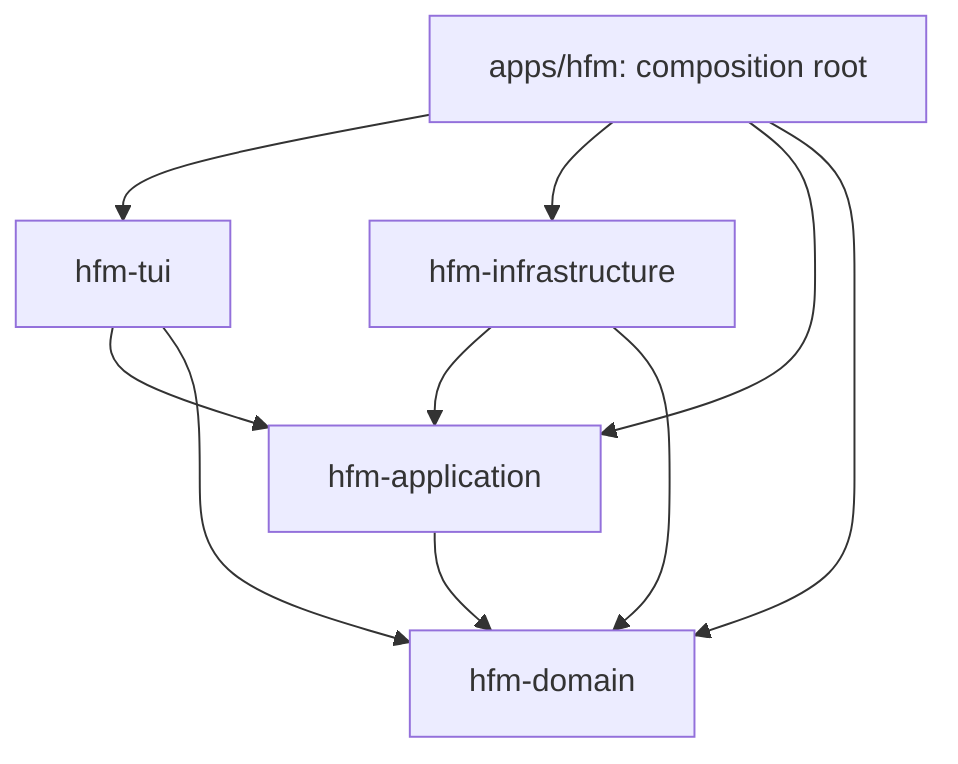

# 워크스페이스 아키텍처

`hfm`은 다섯 개의 Haskell 패키지를 하나의 저장소에서 관리하는 모노레포입니다. 루트 `stack.yaml`과 `cabal.project`가 같은 패키지를 등록합니다. 각 패키지의 `package.yaml`이 원본이고, `stack build`가 생성된 `.cabal`을 갱신합니다.

## 분석과 리팩토링 범위

리팩토링 시작 시 이미 domain/application/infrastructure/tui와 실행 파일로 패키지가 나뉘어 있었습니다. 그러나 application의 `UseCases` 한 모듈에 키 디스패치, 입력 편집, 상태 전이, 파일 작업 순서와 포트 호출이 함께 있었습니다. `Main`의 시작 디렉터리 읽기는 application 포트를 우회했고, 복사 대상 이름 계산은 infrastructure의 `destinationFor`에 묶여 있었습니다. 내부 상태와 오류에 한국어 표시 문구가 들어 있어 표현 계층과도 결합되어 있었습니다.

이번 변경은 기존 워크스페이스와 UI 동작을 유지하며 이 경계를 구체화합니다.

- 상태 전이와 작업 순서는 순수한 `Program` 값으로 기술합니다. 실제 실행은 `runProgram`이 담당합니다.
- 키 처리, 파일 작업, 입력·모드 전이를 응집된 모듈로 나누고 구현 세부 모듈은 패키지 밖에 노출하지 않습니다.
- 시작 디렉터리 읽기도 동일한 요청·포트 경계를 거칩니다.
- 경로 입력 검증, 대상 이름과 경로 포함 관계는 순수 domain 정책입니다.
- application은 `Status`·`FileError`로 의미를 전달하고 tui가 표시 문구와 번역을 결정합니다.

## 패키지 책임과 의존성

| 패키지 | 책임 | 로컬 의존성 |
|---|---|---|
| `packages/hfm-domain` | 엔트리·정렬·숨김·검색 정책, 경로 정책, 선택·텍스트 편집, 입력·설정·언어·테마 타입 | 없음 |
| `packages/hfm-application` | 상태, 순수 실행 계획, 파일 시스템 포트, 의미 기반 상태, 포트 실행기 | domain |
| `packages/hfm-infrastructure` | POSIX 파일 작업, 예외 변환, 64 KiB 미리보기, YAML/XDG 설정, 재귀 검색 | domain, application |
| `packages/hfm-tui` | Brick 렌더링, Vty 입력·터미널, 국제화·상태 표시, 레이아웃·색상·구문 강조 | domain, application |
| `apps/hfm` | CLI 인자, 설정·IO 구현 주입, 터미널 실행 | 위 네 패키지 |

화살표는 컴파일 의존성을 나타냅니다.



infrastructure와 tui는 서로 의존하지 않습니다. domain과 application에는 구체적인 `IO`, Brick/Vty, YAML, POSIX나 실제 파일 시스템 접근이 없습니다. 포트와 요청 타입은 내부 application이 소유하고 외부 어댑터가 이를 구현합니다.

## 순수한 코어와 효과 실행

```text
Vty event
  → Tui.Input.fromVty
  → Workflow.planInput                순수한 계획 생성
  → UseCases.runProgram               주입된 포트 실행
  → Infrastructure.Ports.ioFileSystem 실제 IO
  → 계획의 후속 함수에 결과 전달
  → 새 AppState를 Brick에 반영
```

주요 인터페이스는 다음과 같습니다.

```haskell
planInput :: Input -> AppState -> Program (AppState, Bool)
planStartup :: FilePath -> FilePath -> AppConfig -> (Int, Int)
            -> Program (Either FileError AppState)
runProgram :: Monad m => FileSystem m -> Program a -> m a
handleInput :: Monad m => FileSystem m -> Input -> AppState -> m (AppState, Bool)
```

`Program`은 완료 값인 `Done` 또는 타입이 정해진 `FileRequest`와 결과를 받는 후속 함수인 `Await`입니다. `FileRequest`의 GADT 생성자가 요청별 반환 타입을 고정합니다. 예를 들어 디렉터리 여부는 `Bool`, 파일 미리보기는 `ByteString`, 복사는 `()`입니다. 계획에 임의의 IO 액션을 넣을 수 없습니다.

검색 편집, 테마 선택 같은 동작은 바로 `Done`을 반환합니다. 파일 작업은 `Await`를 반환하고, 호출자가 결과를 제공하면 순수한 후속 함수가 다음 요청이나 완료 상태를 만듭니다. 이 때문에 성공·실패와 응답에 따른 분기까지 포트 구현 없이 검사할 수 있습니다. 후속 함수가 포함된 메모리 내 계획이며 직렬화 가능한 작업 큐는 아닙니다.

복사는 먼저 `DirectoryExists` 요청으로 대상의 파일 시스템 정보를 얻고, domain의 `destinationPath`로 파일명을 계산한 뒤 `CopyEntry`를 요청합니다. 복사가 실패하면 프롬프트를 유지하며 갱신 요청을 만들지 않습니다. 성공하면 두 패널을 읽고 둘 다 성공한 경우 함께 갱신합니다. 두 번째 패널 읽기가 실패하면 기존 패널들을 유지합니다.

`UseCases`는 요청을 `FileSystem m` 레코드의 대응 함수에 전달하는 작은 실행기입니다. 정책이나 키 분기가 없습니다. `handleInput`은 기존 TUI 호출 인터페이스를 유지하는 편의 함수입니다. 실제 IO는 `Main`이 주입한 infrastructure 포트에서만 발생하며, 테스트에서는 `State [String]` 메모리 포트로 호출 순서를 기록합니다.

## application 내부의 응집도

| 모듈 | 책임 |
|---|---|
| `State` | 상태 생성, 패널·검색·선택 갱신, 뷰어 스크롤 범위 |
| `Status` | 표시 언어와 무관한 작업 결과·오류·현재 경로 |
| `Ports` | `FileSystem m` 인터페이스와 `FileError` |
| `Program` | 타입이 정해진 효과 요청과 순수 실행 계획 |
| `Workflow` | 공통 키·모드 디스패치, 탐색·테마 요청 계획 |
| `Startup` | 시작 경로 정규화·목록 읽기 계획 |
| `Internal.Action` | 순수 상태 계산과 요청 실패 처리의 공통 구성 |
| `Internal.Files` | 디렉터리 열기, 미리보기, 복사·이동·생성·갱신 계획 |
| `Internal.Interaction` | 검색·입력 편집, 선택·페이지 이동, 취소·삭제 확인·보기 제어 |
| `UseCases` | 포트 실행과 `handleInput` 진입점 |

`Internal.*`은 Cabal의 `other-modules`이며 다른 패키지가 import할 수 없습니다. 순수 계획 모듈은 실행기나 `FileSystem`을 참조하지 않습니다. `StateT`·`ExceptT`는 순수한 `Program` 위에서 상태와 종료를 구성하며, 임의의 효과 모나드를 내부 계산에 주입하지 않습니다.

## 경로·파일 시스템 경계

`Hfm.Domain.PathPolicy`는 상대·절대 입력 해석, 디렉터리 생성 이름 검증, 대상이 디렉터리일 때 원본 이름을 붙이는 규칙과 경로 포함 관계를 담당합니다. application은 입력 정책을 사용하고, infrastructure도 동일한 경로 계산·포함 관계 정책을 사용합니다. 선택한 파일 경로는 문자열 연결 대신 `(</>)`로 만듭니다.

경로의 실제 존재 여부, 심볼릭 링크와 canonical path는 infrastructure가 확인합니다. 포함 관계는 canonical path를 전달받아 판정하며 비슷한 이름의 형제 경로를 구분합니다. 덮어쓰기 금지·디렉터리 자기 내부 복사/이동 방지 검사와 재귀 작업은 OS 정보를 읽는 어댑터가 실행합니다. 이 검사는 기존과 마찬가지로 확인 후 수행되는 파일 작업이며 동시 파일 시스템 변경에 대한 원자적 트랜잭션을 제공하지는 않습니다.

`Infrastructure.Ports`는 `IOException`을 `Missing`, `PermissionDenied`, `FileFailure`로 변환합니다. 내부 계층은 OS 예외 타입에 의존하지 않습니다. `destinationFor`는 infrastructure의 편의 함수로 유지하지만 application 포트에서는 제거했으며 새 실행 계획이 도메인 정책으로 대상을 계산합니다.

## 표시·레이아웃 경계

`AppState.stStatus`는 한국어 문자열 대신 `Status`입니다. `Copied`, `InvalidDestination`, `Failed FileError`, `CurrentDirectory FilePath` 등을 `Tui.I18n.renderStatus`가 한국어/영어로 표시합니다. `Ports.errorText`는 제거하고 `Tui.I18n.renderFileError`로 옮겼습니다. 사용자 경로는 번역 사전과 일치해도 그대로 표시합니다. OS 오류 상세는 `FileFailure`의 텍스트로 보존하며 기존 알려진 어댑터 오류 문구는 TUI에서 번역합니다.

Brick 리스트는 domain의 `Selection`으로부터 렌더링 시 생성합니다. 내부 상태에는 Brick 위젯 이름이나 리스트를 저장하지 않습니다. `Tui.Layout.prepareLayout`은 문자 셀 너비를 측정해 안내 행 수를 전달하고 뷰어 오프셋을 조정합니다. application은 숫자 크기만 사용합니다.

테마·언어·뷰어 모드와 접두 명령 동작은 유지합니다. 색상과 속성은 `Tui.Theme`, 구문 강조는 `Tui.SyntaxHighlight`에 있습니다. 테마 미리보기는 적용 테마와 분리된 선택 상태를 사용하여 기존 파일 작업 입력을 보존합니다.

## 경계 검사와 개발

```bash
stack build
stack test --fast --ghc-options=-Werror
make check-architecture
python3 scripts/test-keybindings.py
stack run hfm-exe -- /path/to/left /path/to/right
```

`make test`, `scripts/run.sh test`와 CI는 아키텍처 검사와 그 회귀 테스트를 실행합니다. `check-architecture.py`는 Stack/Cabal 워크스페이스 등록 일치, 패키지·모듈 의존성 방향, 내부 계층의 의존성 허용 목록과 구체적 IO 사용, 순수 계획의 실행기·포트 참조를 검사합니다. 정적 규칙 검사이며 전체 Haskell 문법을 해석하는 도구는 아니므로 컴파일·동작 테스트를 함께 사용합니다.

테스트도 책임을 따라 배치합니다.

- domain: 편집·선택·검색과 경로 정책의 경계 조건.
- application: 포트 없이 계획·후속 분기를 검사하고, 메모리 포트로 호출 순서·작업 실패·시작 실패·패널 갱신을 검사.
- infrastructure: 임시 디렉터리의 정렬·숨김·복사·이동·삭제·심볼릭 링크와 설정 디코딩.
- tui: 의미 기반 상태의 번역, 렌더링, 좁은 화면·리사이즈·스크롤·테마·구문 강조.
- architecture: 격리된 워크스페이스에서 역방향 의존성·프레임워크 유입·순수 계획의 포트 호출·등록 누락을 거부하는지 검사.
- PTY: 실행 파일에 실제 키를 보내 탐색·검색·복사·이동·삭제·모달 종료·언어·여섯 테마를 검사.

특정 패키지만 실행하려면 `stack test hfm-domain` 또는 `stack test hfm-application`을 사용합니다. 새 정책은 domain의 순수 함수로, 새 작업은 application의 요청과 계획으로, 실제 구현은 외부 어댑터로 추가합니다. 새로운 포트를 구현하면 `Main`에서 주입하며, 새 UI는 기존 `planInput`/`handleInput`과 내부 상태를 재사용합니다.

외부 호출자의 변경 사항은 `stStatus :: Status`, `errorText` 제거와 `FileSystem.destinationFor` 제거입니다. 사용자 실행 명령과 키 바인딩은 동일합니다.
