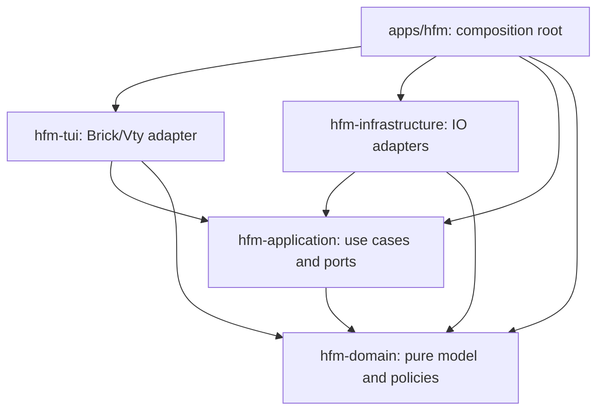

# 워크스페이스 아키텍처

`hfm`은 하나의 저장소에서 다섯 개의 Haskell 패키지를 함께 빌드하는 모노레포입니다. 루트 `stack.yaml`과 `cabal.project`가 같은 로컬 패키지를 등록합니다. 각 패키지는 자신의 `package.yaml`, 생성된 `.cabal`, 소스와 테스트를 갖습니다. Hpack 설정이 원본이며 `stack build`가 `.cabal`을 갱신합니다.

## 기존 결합과 분리 결과

기존 `Types`는 Brick의 `List`와 화면 너비 측정에 의존했고, `Event`는 Vty 키 해석, 입력 편집, 상태 전이, 파일 I/O와 예외 처리를 함께 수행했습니다. `FileManager`에는 엔트리 타입과 디렉터리 정렬 정책이 파일 시스템 접근과 함께 있었으며, `Config`도 설정 타입과 YAML/XDG 파일 접근을 함께 정의했습니다.

이제 엔트리·선택·입력·설정 타입은 domain에, 상태와 작업 순서는 application에, 실제 파일 시스템과 설정 파일 접근은 infrastructure에 있습니다. Brick/Vty 타입과 문자 표시 너비 계산은 tui에 있습니다. 실제 구현의 조립은 실행 파일의 `Main`에서만 수행합니다.

## 패키지 책임과 의존성

| 패키지 | 책임 | 로컬 의존성 |
|---|---|---|
| `packages/hfm-domain` | 엔트리, 정렬·숨김 정책, 선택 범위, 입력 모델·편집, 설정·언어 타입, 퍼지 검색 | 없음 |
| `packages/hfm-application` | 패널·앱 상태, 검색·이동·모드 전이, 파일 작업 유스케이스, `FileSystem m` 포트·오류 타입 | domain |
| `packages/hfm-infrastructure` | POSIX 파일 시스템, 심볼릭 링크 처리, 예외 변환, 제한된 파일 읽기, YAML/XDG 설정, 재귀 파일 검색 | domain, application |
| `packages/hfm-tui` | Brick 렌더링·리스트, Vty 입력 변환·터미널, 국제화, 화면 크기·안내 줄 배치 | domain, application |
| `apps/hfm` | 시작 인자, 의존성 조립, `hfm-exe` 실행 | 위 네 패키지 |

화살표는 컴파일 의존성을 나타냅니다.



infrastructure와 tui는 서로 의존하지 않습니다. application과 domain은 `IO`, Brick, Vty, YAML, POSIX나 실제 디렉터리 접근을 사용하지 않습니다. 각 패키지의 제한된 의존성 선언은 외부 계층의 모듈을 직접 가져오는 것을 컴파일 단계에서 차단합니다. `scripts/check-architecture.py`는 로컬 패키지·모듈 의존성 방향과 내부 계층의 구체적인 I/O 사용도 검사하며 CI에서 실행됩니다.

## 순수 코드와 부수효과의 경계

- `Hfm.Domain.Selection`: 숨겨진 생성자로 선택 인덱스가 범위를 벗어나지 않게 보장합니다. 빈 목록, 처음·끝 이동과 선택 복원은 순수 연산입니다.
- `Hfm.Domain.Editor`: 프레임워크와 무관한 `Input`을 받아 텍스트와 커서의 새 값을 반환합니다.
- `Hfm.Application.State`: 상태 생성, 검색 필터, 선택·패널 갱신, 언어 전환, 스크롤 범위 계산은 순수 함수입니다.
- `Hfm.Application.UseCases`: 파일 읽기·복사·이동·삭제의 실행 순서를 조정합니다. 구체적인 `IO` 대신 `Monad m`과 주입된 `FileSystem m`을 사용합니다. 유스케이스에는 효과를 요청하는 코드가 있으므로 모든 유스케이스가 무효과인 것은 아닙니다. 실제 효과 실행 방식은 어댑터가 정합니다.
- `Hfm.Infrastructure.Ports`: 실제 `IO` 구현을 포트 레코드에 연결합니다. `IOException`은 `Missing`, `PermissionDenied`, `FileFailure`로 변환하므로 내부 계층이 OS 예외 타입에 의존하지 않습니다.
- `Hfm.Tui.Event`: Vty 이벤트를 내부 입력으로 바꾸고 유스케이스를 실행한 뒤 Brick 상태를 갱신하거나 종료합니다. 실제 파일 시스템 구현을 가져오지 않습니다.

포트는 구현체가 아닌 application이 소유합니다.

```haskell
handleInput :: Monad m
            => FileSystem m -> Input -> AppState -> m (AppState, Bool)
```

반환값의 `Bool`은 종료 요청입니다. `Main`은 `app ioFileSystem`으로 실제 구현을 주입합니다. application 테스트는 같은 함수에 `State [String]`으로 구현한 메모리 포트를 주입하여 호출 순서와 결과를 검사합니다. 새 UI를 만들 때도 내부 입력 모델과 이 인터페이스를 재사용할 수 있습니다.

## 표시와 페이지 크기

Brick 리스트는 tui에서 순수한 `Selection Entry`를 변환해 생성합니다. 내부 상태에는 위젯 이름이나 Brick 리스트를 저장하지 않습니다. 위젯 식별자는 `Hfm.Tui.Name`에서만 정의합니다.

한글을 포함한 안내 문구의 표시 셀 너비는 `Hfm.Tui.Layout`이 Brick의 `textWidth`로 측정합니다. `prepareLayout`은 계산한 안내 행 수를 상태에 전달하고 보기 오프셋을 조정합니다. 유스케이스는 숫자로 된 크기만 사용합니다. 언어 전환, 접두 명령, 리사이즈 전후에도 렌더링과 페이지 이동이 같은 측정을 사용합니다. 번역 사전은 `Hfm.Tui.I18n`, 언어 타입은 `Hfm.Domain.Language`에 있습니다.

## 유지한 동작

Emacs/Dired 키, 두 패널 탐색, 검색·입력 편집, 64 KiB 파일 미리보기, 한국어/영어 `F2` 전환을 유지합니다. 복사와 이동은 기존 경로를 덮어쓰지 않습니다. 실제 디렉터리를 자기 내부로 복사하거나 이동하지 않습니다. 심볼릭 링크는 링크 자체를 복사·삭제합니다. 이동은 동일 파일 시스템의 `renamePath`를 사용합니다. 삭제는 명시적인 확인 후 실행합니다.

기존 퍼지 검색, 재귀 검색과 구문 강조 기능은 각각 domain, infrastructure, tui에 유지됩니다. 기존 평면 모듈 이름은 `Hfm.Domain.*`, `Hfm.Application.*`, `Hfm.Infrastructure.*`, `Hfm.Tui.*`로 변경했습니다. 외부에서 기존 `Lib`, `Types`, `Event` 등을 import하던 코드는 새 이름으로 변경해야 합니다.

## 테스트와 개발

루트에서 전체 워크스페이스를 실행합니다.

```bash
stack build
stack test
python3 scripts/check-architecture.py
python3 scripts/test-keybindings.py
stack run hfm-exe -- /path/to/left /path/to/right
```

특정 계층만 테스트할 수도 있습니다.

```bash
stack test hfm-domain
stack test hfm-application
stack test hfm-infrastructure
stack test hfm-tui
```

- domain: 입력 편집, 퍼지 검색, 선택 범위 테스트.
- application: 실제 I/O 없이 언어·검색·종료, 복사 순서, 삭제 확인, 경로 검증, 실패 처리와 바이너리 미리보기 테스트.
- infrastructure: 임시 디렉터리에서 파일 정렬, 심볼릭 링크, 덮어쓰기 방지, 재귀 복사·삭제와 설정 디코딩 테스트.
- tui: 렌더링, 두 언어의 메뉴, 좁은 화면·리사이즈·스크롤과 구문 강조 테스트.
- PTY: 빌드된 실행 파일에 실제 터미널 키를 보내 탐색·파일 작업·모달 종료와 언어 전환을 검사합니다. Stack의 설치 경로를 사용합니다.

새 파일 시스템 구현은 application의 포트를 구현하고 `Main`에서 주입합니다. 새 파일 정책은 순수 domain 함수로 추가하고 infrastructure가 필요한 OS 정보를 전달하도록 합니다. 새로운 프레임워크의 타입이나 예외를 내부 패키지에 넣지 않습니다.
