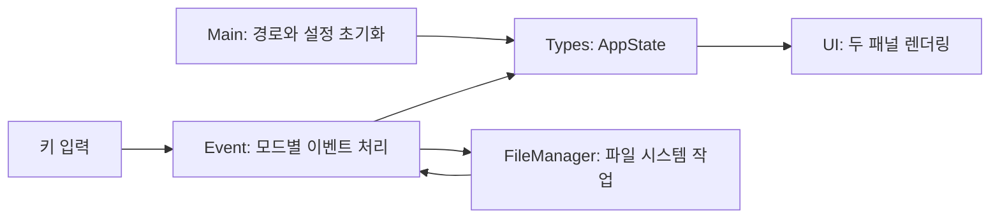

# 아키텍처

`hfm`는 Brick 기반의 두 패널 파일 관리자입니다. 각 패널은 현재 경로, 전체 디렉터리 항목, 화면에 보이는 항목, 검색어와 선택 위치를 갖습니다.

## 모듈

- `app/Main.hs`: 시작 디렉터리 인자 0~2개를 해석하고 두 패널을 초기화합니다.
- `src/Types.hs`: 패널, 활성 패널, 검색·입력·삭제 확인·보기 모드의 상태를 정의합니다.
- `src/Event.hs`: 키를 모드에 따라 처리하며 I/O 오류를 상태 표시줄에 전달합니다.
- `src/UI.hs`: 터미널 크기에 맞춰 두 패널과 명령 입력줄, 상태줄을 그립니다.
- `src/FileManager.hs`: 정렬된 디렉터리 목록, 복사, 이동, 삭제, 디렉터리 생성을 수행합니다.
- `src/Config.hs`: Emacs/Vim 탐색 키 설정을 로드합니다.
- `src/Vty.hs`: `/dev/tty`에서 터미널을 엽니다.

## 파일 작업 규칙

복사와 이동은 기존 경로를 덮어쓰지 않습니다. 실제 디렉터리는 자기 하위 경로로 복사하거나 이동할 수 없습니다. 복사는 심볼릭 링크를 따라가지 않고 링크 자체를 복제합니다. 삭제도 링크 자체를 지웁니다. 삭제는 사용자 확인 후 실행합니다. 이동은 `renamePath`를 사용하므로 같은 파일 시스템 안에서 동작합니다.

과거 퍼지 검색기용 `Fuzzy`, `FileSearch`, `SyntaxHighlight` 모듈은 라이브러리 호환을 위해 남아 있으며 현재 파일 관리자 화면에서는 사용하지 않습니다.
