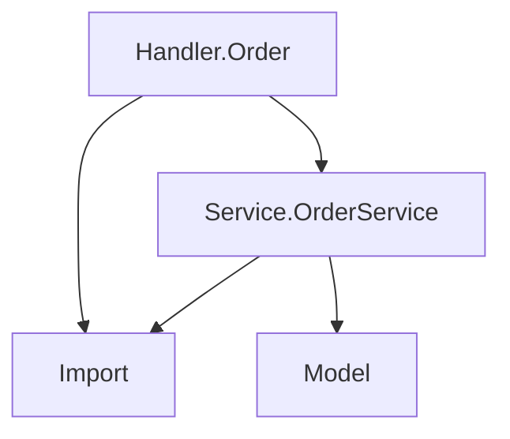

# 역방향 설계서 생성

이 스킬은 CLAUDE.md의 "역방향 산출물 생성" 가이드에 따라, 최종 코드를 기반으로 설계서를 재생성합니다.

## 트리거 조건

다음 요청 시 이 스킬을 사용합니다:

- "설계서 작성해줘", "상세설계서 만들어줘"
- "감리 산출물 생성", "아키텍처 문서 만들어"
- "모듈 의존성 다이어그램", "데이터 타입 정의서"
- "코드 기반으로 문서화해줘"

## 생성 가능한 산출물

### 1. 모듈 의존성 다이어그램

코드에서 `import` 문을 분석하여 모듈 간 의존성을 시각화합니다:

```
수행 절차:
1. Glob으로 src/**/*.hs 파일 목록 수집
2. 각 파일의 import 문을 Grep으로 추출
3. 프로젝트 내부 모듈 간 의존성만 필터링
4. Mermaid 다이어그램 형식으로 출력
```

출력 형식:



### 2. 데이터 타입 정의서

Persistent Entity와 커스텀 타입을 문서화합니다:

```
수행 절차:
1. Read로 config/models.persistentmodels 파일 읽기
2. Grep으로 src/**/*.hs 에서 data/newtype/type 선언 검색
3. 각 타입의 필드, 제약 조건, 관계를 정리
```

출력 형식:

```markdown
## 데이터 타입 정의서

### Persistent Entity

#### User
| 필드 | 타입 | 제약 조건 | 설명 |
|------|------|-----------|------|
| name | Text | - | 사용자 이름 |
| email | Text | UniqueEmail | 이메일 (유니크) |
| createdAt | UTCTime | default=CURRENT_TIME | 생성일시 |

#### 관계
- Order.userId → User (N:1)
```

### 3. Handler 라우트 명세

모든 라우트 엔드포인트를 문서화합니다:

```
수행 절차:
1. Read로 config/routes.yesodroutes 파일 읽기
2. 각 라우트에 대응하는 Handler 함수 확인
3. Handler 함수의 타입 시그니처에서 응답 타입 파악
4. 요구사항 주석([REQ-XXXX])에서 관련 요구사항 연결
```

출력 형식:

```markdown
## API/라우트 명세

| 라우트 | 메서드 | Handler | 응답 타입 | 요구사항 |
|--------|--------|---------|-----------|---------|
| / | GET | getHomeR | Html | - |
| /order | GET | getOrderListR | Html | REQ-F001 |
| /order/#OrderId | GET | getOrderDetailR | Value | REQ-F002 |
```

### 4. 비즈니스 로직 설명

Service 레이어의 비즈니스 로직을 문서화합니다:

```
수행 절차:
1. Glob으로 src/Service/*.hs 파일 목록 수집
2. 각 파일에서 exported 함수의 타입 시그니처와 Haddock 주석 추출
3. 함수 간 호출 관계 파악
4. 비즈니스 규칙 요약
```

### 5. 전체 상세설계서

위 1~4번을 모두 포함하는 통합 문서를 생성합니다.

## 출력 옵션

AskUserQuestion으로 사용자에게 확인합니다:

- **산출물 종류**: 위 5가지 중 선택 (복수 선택 가능)
- **출력 형식**: 마크다운 파일 / 터미널 출력
- **파일 저장 위치**: docs/ 디렉토리 (기본값)

## 주의사항

- 설계서 생성은 코드를 읽기만 합니다. 코드를 수정하지 않습니다.
- 코드에서 추출할 수 없는 비즈니스 맥락은 사용자에게 확인합니다.
- Mermaid 다이어그램은 마크다운 미리보기에서 렌더링됩니다.
